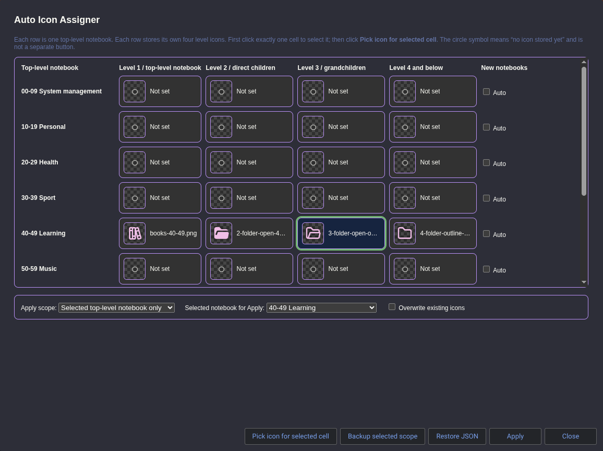

# Joplin Auto Icon Assigner



## What this plugin does

Joplin lets users manually set custom notebook icons, but changing icons for a large nested notebook tree is slow. This plugin helps automate that process.

It lets you define up to four icon levels **per top-level notebook**:

| Level | Meaning |
|---|---|
| Level 1 | The top-level notebook itself |
| Level 2 | Direct child folders/notebooks |
| Level 3 | Grandchild folders/notebooks |
| Level 4+ | Level 4 and everything deeper |

The configuration is stored separately for each top-level notebook.

For example, if you have three top-level notebooks, the plugin stores:

```text
3 top-level notebooks × 4 icon levels = 12 icon slots
```

This is useful if, for example:

- top-level notebook A uses blue-themed icons,
- top-level notebook B uses green-themed icons,
- sublevels keep the same color but use different symbols.

---

## Current main features

- One notebook/folder right-click context entry:

  ```text
  Auto Icon Assigner: Choose/configure icons…
  ```

- Tools menu submenu:

  ```text
  Tools > Auto Icon Assigner
  ```

- Matrix UI:
  - rows = top-level notebooks,
  - columns = hierarchy levels 1, 2, 3, and 4+.
- Per-top-level-notebook auto-assign toggle.
- Global auto-assign toggle.
- Folder creation polling interval setting.
- Apply stored icons with either:
  - skip existing icons,
  - overwrite existing icons.
- Preview/dry-run mode with expandable details.
- Backup current notebook icons to a Joplin note.
- Copy backup JSON to clipboard where supported by Joplin.
- Restore icons from pasted backup JSON.
- Automatic backup before apply/restore operations.
- Apply reports appended to backup notes.
- Dark-theme-aware modal styling.
- Scrollable matrix modal for smaller Joplin windows.

---

## Installation

### Install from `.jpl`

Use the built plugin package [here :palm_up_hand:](publish/com.arena.joplin-auto-icon-assigner-0.1.8.jpl):

```text
publish/com.arena.joplin-auto-icon-assigner-0.1.8.jpl
```

In Joplin Desktop:

1. Open **Tools > Options > Plugins**.
2. Choose **Install from file**.
3. Select the `.jpl` file.
4. Restart Joplin.

After restart, check:

```text
Tools > Auto Icon Assigner
```

or right-click a notebook/folder in the left sidebar and look for:

```text
Auto Icon Assigner: Choose/configure icons…
```

---

## Safe first-use workflow

If you already have many manually curated icons, be cautious.

Recommended first test:

1. Create or switch to a separate Joplin test profile.
2. Install the plugin there first.
3. Create a few test notebooks and sub-notebooks.
4. Use the matrix modal to assign test icons.
5. Run **Preview stored icons; no changes**.
6. Use **Apply stored icons; skip existing** before ever using overwrite.

For real data, make a backup of your Joplin profile first.

On Linux, this is often:

```bash
cp -a ~/.config/joplin-desktop ~/.config/joplin-desktop.backup-before-auto-icon-assigner
```

The plugin also creates icon-state backup notes before applying/restoring, but a full Joplin profile backup is still safest.

---

## Usage

### Main matrix UI

Open it via either:

```text
Right-click notebook/folder > Auto Icon Assigner: Choose/configure icons…
```

or:

```text
Tools > Auto Icon Assigner > Auto Icon Assigner: Choose/configure icons…
```

The modal shows a matrix:

```text
Top-level notebook | Level 1 | Level 2 | Level 3 | Level 4+ | Auto
Notebook A         | [cell]  | [cell]  | [cell]  | [cell]   | [ ]
Notebook B         | [cell]  | [cell]  | [cell]  | [cell]   | [ ]
```

To configure an icon:

1. Select a cell.
2. Click **Choose icon for selected cell**.
3. Pick a PNG/JPG/JPEG file.
4. Repeat for other cells.

To apply icons:

1. Choose the apply scope:
   - selected top-level notebook only,
   - all configured top-level notebooks.
2. Choose whether to overwrite existing icons.
3. Click **Apply**.

If overwrite is enabled, the plugin asks for confirmation.

---

## Backup and restore

### Manual backup

Available from:

```text
Tools > Auto Icon Assigner
```

Commands:

```text
Auto Icon Assigner: Backup selected top-level notebook icons
Auto Icon Assigner: Backup all notebook icons
```

The plugin creates a Joplin note containing JSON such as:

```json
{
  "schema": "joplin-auto-icon-assigner.icon-backup",
  "version": 1,
  "createdAt": "...",
  "reason": "manual backup",
  "folders": []
}
```

It also tries to copy the JSON to the clipboard.

### Automatic backup

Before applying icons or restoring from JSON, the plugin automatically creates a backup note of the current icon state.

This means restore is usually possible even after a bad apply operation.

### Restore

Use:

```text
Tools > Auto Icon Assigner > Auto Icon Assigner: Restore icons from backup JSON…
```

Paste either:

- the raw JSON backup, or
- a full backup note that contains the fenced JSON block.

The plugin will parse the JSON and restore `folders.icon` values.

---

## Build locally

Requirements:

- Node.js 20 recommended
- npm

Build:

```bash
cd joplin-auto-icon-assigner
npm install
npm run dist
```

Output:

```text
publish/com.arena.joplin-auto-icon-assigner-0.1.8.jpl
```

---

## Build with Docker

A Dockerfile is included.

```bash
cd joplin-auto-icon-assigner
docker build -t joplin-auto-icon-assigner .
docker create --name jai joplin-auto-icon-assigner
docker cp jai:/plugin/publish ./publish
docker rm jai
```

The `.jpl` file will be copied to:

```text
publish/
```

---

## Version history

### 0.1.0

- Initial implementation.
- Basic recursive icon assignment by hierarchy level.
- Per-top-level notebook configuration concept.

Known issue:

- The `.jpl` was incorrectly packaged as ZIP instead of TAR.

### 0.1.1

- Added Tools menu fallback.
- Added diagnostic/self-test command.
- Reduced startup fragility.

Known issue:

- Still had runtime packaging/API shim problems.

### 0.1.2

- Fixed the bundled Joplin `api` shim problem.
- Corrected packaging enough for Joplin to load the plugin.

### 0.1.3

- Added safer workflow.
- Added preview command.
- Removed startup toast.
- Improved settings icon viewer via modal.

### 0.1.4

- Restored reliable folder context menu entries as individual items.
- Discovered that Joplin does not reliably show plugin-created submenus in `FolderContextMenu`.

### 0.1.5

- Reworked UI into a matrix workflow.
- One row per top-level notebook.
- Four level cells per row.
- Improved dark-theme support.
- Made right-click action open one modal instead of multiple commands.

### 0.1.6

- Fixed modal reuse bug by using unique dialog IDs.
- Added per-notebook/per-level settings entries where supported.
- Clarified limitations of Joplin settings UI.

### 0.1.7

- Made modal matrix scrollable/responsive.
- Improved display on smaller windows.
- Added read-only status fields in settings where possible.

### 0.1.8

- Added manual backup/export.
- Added backup notes inside Joplin.
- Added clipboard JSON export where supported.
- Added restore/import from backup JSON.
- Added automatic backups before apply/restore.
- Added dry-run details table.
- Added apply reports appended to backup notes.

---

## Known gotchas / cursed knowledge

### `.jpl` files are TAR archives, not ZIP files

> [!CAUTION]
> `.jpl` files are TAR archives, not ZIP files

This was a major debugging point.

A `.jpl` is essentially the contents of the plugin `dist` folder packed into a TAR archive. If you create a ZIP file and rename it to `.jpl`, Joplin may fail with errors such as:

```text
invalid base256 encoding
```

The packaging script now uses `tar`, not ZIP.

### `manifest.json` must be at the archive root

Inside the `.jpl`, Joplin expects:

```text
index.js
manifest.json
```

not:

```text
dist/index.js
```

and not:

```text
some-folder/manifest.json
```

### Do not externalize `api`

The plugin originally compiled with a runtime `require("api")`, which caused:

```text
Cannot find module 'api'
```

The fix was to bundle the standard Joplin plugin API shim via a local `api/` alias.

### Development plugin path should be the project root

Joplin appends `dist/index.js` internally when loading a development plugin.

So this is wrong:

```text
/path/to/plugin/dist
```

because Joplin will look for:

```text
/path/to/plugin/dist/dist/index.js
```

Use the project root instead.

### Folder context menu submenus may not show

`joplin.views.menus.create(..., MenuItemLocation.Tools)` works for Tools submenus.

But plugin-created submenus in `FolderContextMenu` did not reliably show in testing. The plugin now uses one folder context menu item that opens the matrix modal.

### Joplin settings cannot embed a real custom matrix

The native plugin settings screen supports standard controls but not arbitrary custom HTML/image grids. The real matrix is therefore implemented as a plugin dialog/modal.

The settings page only shows global controls and best-effort read-only status fields.

### Folder creation auto-assign uses polling

Joplin does not currently expose a dedicated `onFolderCreated` plugin event. The plugin polls the Data API events endpoint instead.

This is why there is a setting:

```text
Folder creation polling interval, seconds
```

### Large icons may bloat sync data

The plugin stores selected images as base64 data URLs in the folder icon field. Very large image files could increase database/sync size. Prefer small PNG/JPG icons.

---

## Future ideas

### 1. Image size warning / resizing

Warn when a selected icon file is large, e.g. over 256 KB.

Possible implementation:

- check `fs.statSync(filePath).size` before reading,
- show a confirmation dialog if too large,
- optionally reject files above a hard limit.

Resizing would require adding an image processing library or using Electron APIs if available from the plugin runtime.

### 2. True “undo last apply”

Currently, manual undo is possible by restoring the automatic backup note created before apply.

A future command could:

1. find the latest Auto Icon Assigner backup note,
2. parse its JSON,
3. restore it.

Care is needed for renamed/deleted folders, sync conflicts, and partial restores.

### 3. Better itemized preview filters

The dry-run details table could be filterable by:

- would change,
- skipped existing,
- missing config,
- errors.

Possible implementation:

- add client-side JavaScript to the preview dialog,
- filter table rows by CSS classes.

### 4. Row-level apply buttons

Each top-level notebook row could have its own apply button.

Joplin dialogs do not directly allow each HTML button to trigger plugin code unless using dialog scripts/postMessage or form state tricks. The simpler approach would be:

- select row,
- choose action from dialog button.

### 5. Separate tabs/sections

The matrix modal could be split into:

```text
Configure | Preview | Apply | Backup / Restore
```

This is mostly UI work and would improve clarity.

Possible implementation:

- add dialog script with client-side tab switching,
- keep all state in form fields,
- submit selected action through dialog buttons.

### 6. More robust settings page sync

Dynamic settings are registered at plugin startup. If top-level notebooks are added or removed, the settings list may not update until restart.

Possible improvement:

- add a “Refresh settings entries” command,
- or listen to event polling and ask user to restart/reload plugin.

### 7. Optional built-in icon presets

Bundle icon sets directly in the plugin, so users can choose without file pickers.

Possible implementation:

- include small PNG/SVG assets in `src/assets`,
- convert them to data URLs at build time or runtime,
- expose preset buttons in the matrix.

### 8. Mobile support

Not currently planned.

Reasons:

- no equivalent reliable notebook right-click context menu,
- desktop file picker API does not map cleanly to mobile,
- Joplin mobile plugin dialogs/file handling are more constrained.

A mobile version would likely need a separate UX and possibly resource-based icon selection instead of native file picking.

---

## Internal data model

Per-top-level notebook config is stored as Joplin item user data on the top-level folder:

```text
com.arena.joplin-auto-icon-assigner.rootConfig.v1
```

Shape:

```ts
interface RootIconConfig {
  version: 1;
  rootId: string;
  rootTitle: string;
  icons: Partial<Record<'1' | '2' | '3' | '4', string>>;
  sourceFileNames: Partial<Record<'1' | '2' | '3' | '4', string>>;
  autoAssignOnCreation: boolean;
  updatedAt: string;
}
```

Each icon is stored in Joplin’s folder icon JSON format:

```json
{
  "type": 2,
  "emoji": "",
  "name": "",
  "dataUrl": "data:image/png;base64,..."
}
```

---

## License

MIT, unless changed by the repository owner.

----


A Joplin Desktop plugin for bulk-assigning custom notebook/folder icons by hierarchy level.

> **Disclaimer**
>
> This plugin was mainly generated with the help of an AI assistant running in **Arena.ai Agent Mode** and then iteratively adjusted through testing feedback. Arena.ai Agent Mode may use different underlying models, but this repository should be considered AI-assisted code rather than hand-audited production software.
>
> **The code has not been security-audited.** Use it carefully, keep backups, and test it on a separate Joplin profile before using it on an important notebook tree.

